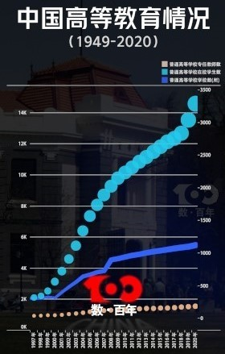
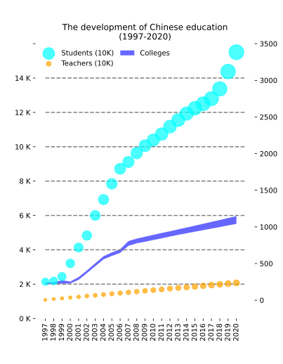

## 
The improvements of “the situation of China’s higher education”

<h3>Group-18</h3>

<h2>Abstract</h2>

In the process of making a visualization of a given dataset, there would be a lot of elements that need to take in to consideration. For the user, when reading a visualization, the image can express the relationship between data clearly and accurately, so that the user will not feel confused and upset at the first sight of the visualization, not damaging the structure of the data itself at the same time. Then this visualization can be said to be relatively successful.
 
In this project, our team selected the story about the situation of Chinese higher education. We used a visualization published by Xinhua News Agency and transformed it into a more readable version. However, it should be noted that the original image is not actually a "failed" visualization, because in its original version, the original image focusing more on decorating the article, that is, it pays more attention to the beauty of the image. The result is that the readability is reduced. For the reader, the first impression of this chart will be the chart itself rather than the data it reflects.
 
Of course, after our simple transformation, this visualization becomes easier to read. In the process of information visualization for academic purposes, what we focusing on has to be the readability of the visualization. Through such comparison, what we want to illustrate is the importance of information visualization skills in academic papers.

We will first describe the story expressed in the graph, then our improvement, and finally we will summarize the entire report.

<h2>The story of the graph</h2>

September is the back-to-school season for Chinese colleges and universities. Many Chinese young people go to the campus of colleges and universities. China's institutions of higher education have produced generations of promising young Chinese people who have devoted themselves to all walks of life in China's development.	

The spectacular development of China's modern higher education can be traced back to October 2, 1895, when the predecessor of Tianjin University, Imperial Tientsin University, was born in Tianjin.

At the beginning of the People's Republic of China, there were only 205 general colleges and universities in China. After decades of development, especially after the Chinese general colleges and universities began enrollment expansion in 1999, the number of general colleges and universities, the number of students, the number of graduates and the size of schools have all exploded.	

In order to understand the specific information, We are in the article (http://www.news.cn/datanews/20211015/C999058529900001C39214B0FE601D68/c.html)
,found a graph:
(http://www.news.cn/datanews/20211015/C999058529900001C39214B0FE601D68/20211015C999058529900001C39214B0FE601D68_1211351537_1630390571638_title.jpg)
However, when reviewing the data of the graph, our team found a lot of inadequacies in the  visualization of the graph.

On the X-axis is the year information, from 1997 to 2020. The Y-axis is divided into the left and right sides, the left side represents the number of schools. On the right, indicates the number of teachers and students. The unit is ten thousand. The Y-axis on the left corresponds to the dark blue broken line in the graph, which represents the number of general colleges and universities; The Y-axis on the right corresponds to the two scatter points in the graph. The blue scatter points indicates the number of students in general colleges and universities, and the brown scatter points indicates the number of full-time teachers in general colleges and universities.

The data looks neat, but it actually has some shortcomings in visualization. First, our team found that the relative length of its X-axis was short, which made the X-axis coordinates representing the year vertical and not convenient for us to observe. Secondly, when the scatter points represent the number of people, the change trend is not particularly intuitive, and the scatter points are too large for us to directly observe the specific data of the number of people in different years. Finally, the origin’s height of the Y-axis coordinates on both sides is different, the coordinate interval of the left Y-axis is too large (the coordinates of 6K~14K even have no effect), and the coordinate on the right is not guided by a straight line, which is not convenient for data observation.

In response to these problems, our team decided to improve the visualization graph.
This graph shows the trend of China's modern higher education (1997-2020) from elitism to popularization and then to popularization. China becomes one of the largest countries of higher education in the world. It is an important graph material for understanding and studying the development of China's modern higher education. Therefore, it is of great significance to improve the graph.

<h2>Improvements</h2>

 
To improve this visualization, first we need to restore it in to a vector diagram. We used matplotlib to do this. Here is the diagram we restored. We output it in a .svg format. We put the original image aside for comparison.

Original picture
 

 
 
 
 
 
 
 
 

You may find that the data size in the graph is slightly different, because we actually do not have the original dataset, but fabricate a set of approximate datasets for use. This is because there is no specific data set in the original text, so we have to use the data we made up. But this is not the key point. We want to show the improvement of this chart, not the real data.
 
In the previous context, we mentioned three shortages of the original visualization. The first is the usage of the two y-axes. The two y-axes of one on the left and one on the right interfere with the resolution of units. The solution is also simple: divide this plot into two subplots. One plot is used to describe the data of the left y-axis: the number of universities, and one plot is used to describe the data of the right y-axis: the number of tutors and students.

Second, the plot type used is a scatter plot. Although it can roughly show the trend of data changes, it cannot show the size of data accurate enough. Here, we choose the line plot cooperating with nodes for data visualization. On the one hand, it can show the growth of data more clearly, on the other hand, it can show the size of data more accurately. At the same time, we will unify the legend and use different colors to distinguish different data.

Finally, the width of the x-axis is too narrow. We lengthen the horizontal axis so that the plot can output all the years horizontally without overlapping. Here is our final finished picture.

Improved picture
 

 
This is the final version of our improvement of the original plot. Comparing it with the original plot, and you will find that it is more intuitive for data presentation. You can see the growth of the data clearly and obtain the size of the data accurately. Compared with the original plot, it is much cleaner.

<h2>Summary</h2>

Overall, we stated the reason for choosing this visualization, the story of visualization and the improvement of visualization. I believe you have got a preliminary impression of information visualization technics. In the process of data processing and presentation, information visualization skills for practical purposes can make data presentation cleaner and more efficient. Readers can easily obtain the required information and stories from the visualization, so that they can have a deeper understanding of the dataset displayed.

